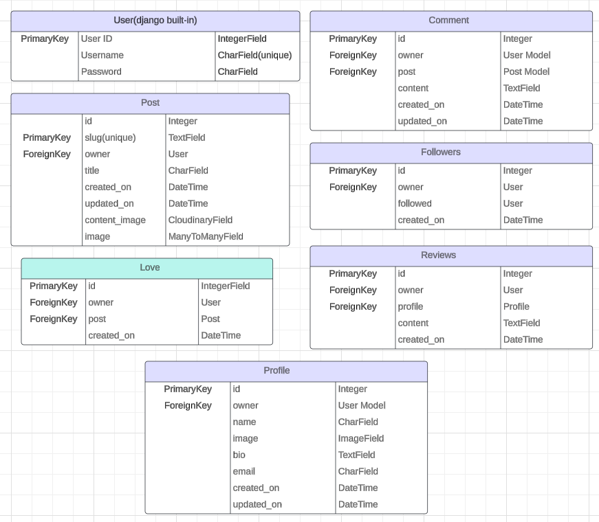

Forever Foundations API is a Django-based web application designed for users to either find their dream wedding venue or share their own venue. The API enables user authentication, profile management, leaving comments, liking other posts, reviewing other users and following other users.

You can visit the website here: [Forever Foundations](https://forever-foundations-e27644123eb0.herokuapp.com/)

You can visit the API here: [Forever Foundations API](https://forever-foundations-api-449e3c9227c3.herokuapp.com/)

# Planning

## Project Board

User stories and developer stories for the frontend and the API were both created using the same board to keep things easier and located together.

[Here is the project user story board.](https://github.com/users/RachaelBull/projects/5)

# Model Diagrams

Various data models were made a detailed note of before they were to be created within the workspace.

## Model Relationships

### Followers

* User - This model shares a relationship and links back to the User Model.
* ManyToMany: Followers represent a ManyToMany relationship with users. A user can follow many users, and each user can also be followed by many users too.

### Comments

* User - This model shares a relationship and links back to the User Model.
* Post - This model shares a relationship and links back to the Post Model.
* OneToMany - Comments are linked with posts. Each post can have multiple comments, but each comment is linked to only one post at a time.
* OneToMany - Comments are created by users, forming an additonal OneToMany relationship. A user can write multiple comments, but each comment is linked to only one user.

### Reviews

* User - This model shares a relationship and links back to the User Model.
* Profile - This model shares a relationship and links back to the Profile Model.
* OneToMany - Reviews are linked with profiles. Each profile can have multiple reviews, but each review is linked to only one profile at a time.
* OneToMany - Reviews are created by users, forming an additonal OneToMany relationship. A user can write multiple reviews, but each review is linked to only one user.

### Loves

* Post - This model shares a relationship and links back to the Post Model.
* User - This model shares a relationship and links back to the User Model.
* OneToMany - Likes are linked to posts. Each post can have multiple likes, but each like is linked to only one post.
* OneToMany - A user can like multiple posts, but each like is attributed to only one user.

### Followers

* User - This model shares a relationship and links back to the User Model.
* ManyToMany - A user can follow many users, and each user can be followed by many users.

### Profile

* User - This model shares a relationship and links back to the User Model.
* OneToOne - Each user has a profile, creating a OneToOne relationship. This ensures that each user has only one profile.

# Apps

**Profile**

When a new user is created within the frontend app, a Profile is automatically created for them. If the user then choses to, this can be editted from their profile page when they log in.

- */profiles/*: to list profiles.
- */profiles/:id/*: to view or update a profile.

**Posts**

A user is able to create a listing (post) once they have created an account where they can select and image and fill in title, email and content feilds.

-*/posts/*: to list or create posts.
- */posts/:id/*: to show, update or delete a post.

**Comments**

A logged in user is able to create comments on other users or their own posts. A non logged in user is able to display and read these comments but not create them.

- */comments/*: to list all comments or create a new comment.
- */comments/:id/*: to show a specific comment, update or delete a comment.

**Reviews**

A logged in user is able to create reviews on other users profiles but not on their own. A non logged in user is able to display these review but not create them.

- */reviews/*: to list all reviews or create a new review.
- */reviews/:id/*: to show a specific review, update or delete a review.

**Loves**

A logged in user is able to leave loves on peoples posts but not on their own, none logged in users can display the number of likes but cannot create them.

- */likes/*: to list or create likes.
- */likes/:id/*: to show or delete a like.

**Followers**

None logged in users are able to display a following count from the profiles pages but are not able to follow any account from any of the pages. A logged in user is able to follow other users from various pages.

- */followers/*: to list profiles.
- */followers/:id/*: to show or delete a follow.

## The testing for this can be found in the TESTING.md file.

# Packages Used

asgiref==3.7.2
cloudinary==1.37.0
dj-database-url==0.5.0
dj-rest-auth==2.1.9
Django==3.2.23
django-allauth==0.50.0
django-cloudinary-storage==0.3.0
django-cors-headers==4.3.1
django-filter==23.5
django-resized==1.0.2
djangorestframework==3.14.0
djangorestframework-simplejwt==5.3.1
gunicorn==21.2.0
oauthlib==3.2.2
Pillow==10.1.0
psycopg2==2.9.9
PyJWT==2.8.0
python3-openid==3.2.0
pytz==2023.3.post1
requests-oauthlib==1.3.1
sqlparse==0.4.4

# Deployment

**Create Repository**

Create a new repository within your workspace.

**Set Up The Project**

- Install Django:
    * pip install 'django<4'
- Create a Django project:
    * django-admin startproject <name>
- Install supporting libraries:
    * pip install django-cloudinary-storage
    * pip install Pillow
- Create requirements.txt file:
    * pip freeze --local > requirements.txt

**Set Up Your Database**

Below are the instructions for if you were using [ElephantSQL](https://customer.elephantsql.com/login).

- Log in to your account
- Click Create New Instance
- Give the instance a name and select the plan of your choice, Tiny Turtle is the free plan.
- Click Select Region and choose a data center
- Click Review and if the details are correct click Create instance
- Click on the created instance and copy the database URL

**Set Up Your Cloudinary**

- Log in to your Cloudinary account
- Copy the link from the API Environment variable

**Set Up Heroku**

- Log in to your Heroku account
- Click New - Create new app
- Give the app a name
- Select a region and click Create app
- Select your created app and open the Settings tab
- At the Config Vars section click Reveal Config Vars and add the following:
    * DATABASE_URL with the copied URL from ElephantSQL
    * SECRET_KEY with your secret key
    * CLOUDINARY_URL with the copied URL from Cloudinary
    * DISABLE_COLLECTSTATIC with the value 1
    * ALLOWED_HOST with the value of your deployed Heroku application URL

**Forking**

Navigate to the repository that you are wishing to Fork.

- On the top right of the page under the header, click the 'Fork' button.
- This will now have created a duplicate of the full project in your GitHub Repository ready for you to use.

**Cloning**

Navigate the the repository that you are wishing to clone.

- Click on the 'Code' drop down button.
- Click on HTTPS and copy the repository link provided.
- Open your IDE of choice (please ensure that you have git installed for the next steps).
- Type 'git clone copied-git-url' into the terminal.
- The project will now be cloned and ready for you to use.

## Credits

- Code Institute LMS walkthrough projects for DRF and React helped me understand and implement my project better by going into thorough detail about what was happening and why. Because of this, I was able to create custom apps and models.